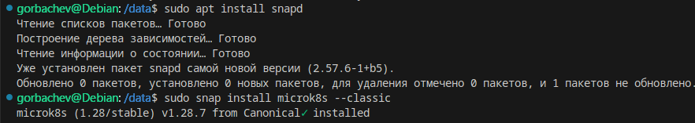
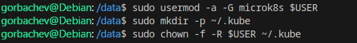
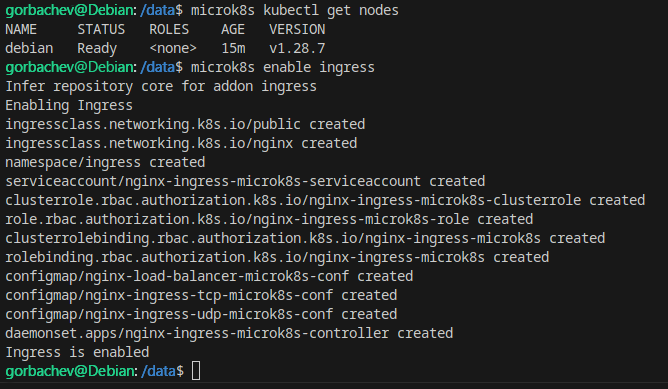
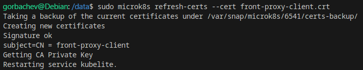

# Домашнее задание к занятию «Kubernetes. Причины появления. Команда kubectl» - `Горбачёв Олег`

### Инструкция к заданию

1. Установка MicroK8S:
    - sudo apt update,
    - sudo apt install snapd,
    - sudo snap install microk8s --classic,
    - добавить локального пользователя в группу `sudo usermod -a -G microk8s $USER`,
    - изменить права на папку с конфигурацией `sudo chown -f -R $USER ~/.kube`.

2. Полезные команды:
    - проверить статус `microk8s status --wait-ready`;
    - подключиться к microK8s и получить информацию можно через команду `microk8s command`, например, `microk8s kubectl get nodes`;
    - включить addon можно через команду `microk8s enable`; 
    - список addon `microk8s status`;
    - вывод конфигурации `microk8s config`;
    - проброс порта для подключения локально `microk8s kubectl port-forward -n kube-system service/kubernetes-dashboard 10443:443`.

3. Настройка внешнего подключения:
    - отредактировать файл /var/snap/microk8s/current/certs/csr.conf.template
    ```shell
    # [ alt_names ]
    # Add
    # IP.4 = 123.45.67.89
    ```
    - обновить сертификаты `sudo microk8s refresh-certs --cert front-proxy-client.crt`.

4. Установка kubectl:
    - curl -LO https://storage.googleapis.com/kubernetes-release/release/`curl -s https://storage.googleapis.com/kubernetes-release/release/stable.txt`/bin/linux/amd64/kubectl;
    - chmod +x ./kubectl;
    - sudo mv ./kubectl /usr/local/bin/kubectl;
    - настройка автодополнения в текущую сессию `bash source <(kubectl completion bash)`;
    - добавление автодополнения в командную оболочку bash `echo "source <(kubectl completion bash)" >> ~/.bashrc`.

------

### Инструменты и дополнительные материалы, которые пригодятся для выполнения задания

1. [Инструкция](https://microk8s.io/docs/getting-started) по установке MicroK8S.
2. [Инструкция](https://kubernetes.io/ru/docs/reference/kubectl/cheatsheet/#bash) по установке автодополнения **kubectl**.
3. [Шпаргалка](https://kubernetes.io/ru/docs/reference/kubectl/cheatsheet/) по **kubectl**.

------

### Задание 1. Установка MicroK8S

1. Установить MicroK8S на локальную машину или на удалённую виртуальную машину.
2. Установить dashboard.
3. Сгенерировать сертификат для подключения к внешнему ip-адресу.

------

### Задание 2. Установка и настройка локального kubectl
1. Установить на локальную машину kubectl.
2. Настроить локально подключение к кластеру.
3. Подключиться к дашборду с помощью port-forward.

------

### Выполнение задания 1. Установка MicroK8S

1. Устанавливаю MicroK8S на локальную машину:



Добавляю пользователя в группу microk8s, создаю директорию с конфигурацией и даю пользователю доступ к этой директории:



Командой `microk8s status --wait-ready` проверяю статус MicroK8S:


Вижу статус `microk8s is running`.

Также можно посмотреть ноды, включить аддоны, посмотреть конфигурацию и т.д.:



Поскольку я запустил только MicroK8S, у меня работает всего одна нода.

Устанавливаю Kubernetes Dashboard:


Редактирую файл `/var/snap/microk8s/current/certs/csr.conf.template` и добавляю адрес для внешнего подключения:


Обновляю сертификаты:



### Выполнение задания 2. Установка и настройка локального kubectl

1. Используя curl скачиваю `kubectl`, даю права на запуск, проверяю выполнение команды `kubectl`, например, выполняю команду `kubectl get nodes`:


2. Используя `port-forward` подключаюсь к Kubernetes Dashboard:


Узнаю токен для входа в Kubernetes Dashboard:


3. Авторизуюсь в Kubernetes Dashboard:


